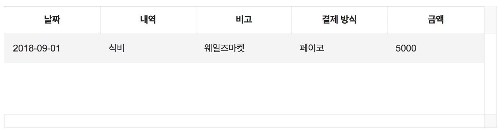

##############################
그리드 생성하기
##############################

HTML 초기 코드 작성
==============================

준비된 ``src/index.html`` 파일을 열어 ``body`` 태그 내부에 컨테이너 태그를 작성해 줍니다.

.. code-block:: html

  // src/index.html

  <body>
    ...
    

    ...
  </body>

자바스크립트 초기 코드 작성
==============================

인스턴스를 생성해봅니다. 이때 반드시 기본 옵션을 파라미터로 넘겨주어야 합니다.
``src/index.js`` 파일을 열고 다음 코드를 추가해봅니다.

* 기본 옵션 정보
    * ``el`` : 그리드가 생성되는 컨테이너 엘리먼트 지정
    * ``columns`` : 그리드 컬럼 정보 설정
    * ``data`` : 초기 생성 데이터 설정
* 더 많은 옵션 보기 : |link|

.. |link| raw:: html 

  <a href="https://nhn.github.io/tui.grid/latest/Grid" target="_blank">링크</a>

.. code-block:: javascript

  // src/index.js

  import Grid from 'tui-grid';

  import 'tui-grid/dist/tui-grid.css';

  const options = {
    el: document.getElementById('grid'),
    columns: [
      {
        header: 'Name',
        name: 'name'
      },
      {
        header: 'Artist',
        name: 'artist'
      },
      {
        header: 'Price',
        name: 'price'
      },
      {
        header: 'Genre',
        name: 'genre'
      }
    ],
    data: [
      {
        name: 'Beautiful Lies',
        artist: 'Birdy',
        price: 10000,
        genre: 'Pop'
      }
    ]
  };

  const grid = new Grid(options); // 그리드 인스턴스 생성

인스턴스를 생성하는 코드 아래에 API를 호출하는 코드를 추가해봅니다.

* API 보기 : |API|

.. |API| raw:: html 

  <a href="https://nhn.github.io/tui.grid/latest/Grid#appendRow" target="_blank">링크</a>

.. code-block:: javascript

    // src/index.js
    ...

    const rowData = [
      {
        name: 'X',
        artist: 'Ed Sheeran',
        price: 20000,
        genre: 'Pop'
      },
      {
        name: 'A Head Full Of Dreams',
        artist: 'Coldplay',
        price: 25000,
        genre: 'Rock'
      }
    ];

    rowData.forEach(row => {
      grid.appendRow(row);
    });

개발 서버에 접속한 브라우저에서 그리드가 생성되었는지 확인합니다.
코드를 수정하면 브라우저는 자동으로 리프레시됩니다.

결과 화면
==============================

