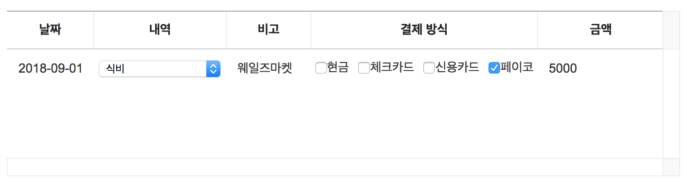

##############################
가계부 레이아웃 만들기
##############################

지금부터 간단한 가계부를 만들어보겠습니다.
이전에 살펴보았던 기능들을 이용해 가계부의 기본 정보를 추가해 레이아웃을 만들어봅니다.

앞으로 추가될 코드는 프로젝트 폴더의 ``src/index.js`` 파일에 작성합니다.
앞에서 작성한 기본 그리드 생성 코드를 지우고, 아래와 같이 가계부 데이터를 바탕으로 그리드를 다시 생성해봅니다.

컬럼 설정하기
==============================

.. code-block:: javascript

    ...

    const columnData = [
      {
        title: '날짜',
        name: 'date'
      },
      {
        title: '내역',
        name: 'category1'
      },
      {
        title: '비고',
        name: 'category2'
      },
      {
        title: '결제 방식',
        name: 'payment'
      },
      {
        title: '금액',
        name: 'amount'
      }
    ];

    const grid = new Grid({
      el: document.getElementById('grid'),
      data: [],
      columns: columnData
    });

기본 데이터 설정하기
==============================

``data`` 옵션에 설정된 값을 변경해봅니다.

.. code-block:: javascript

    ...

    const rowData = [
      {
        date: '2018-11-19',
        category1: '식비',
        category2: '회사 편의점',
        payment: '페이코',
        amount: '5000'
      }
    ];

    const grid = new Grid({
      el: document.getElementById('grid'),
      data: rowData, // 변경
      columns: columnData
    });

결과 화면
==============================

