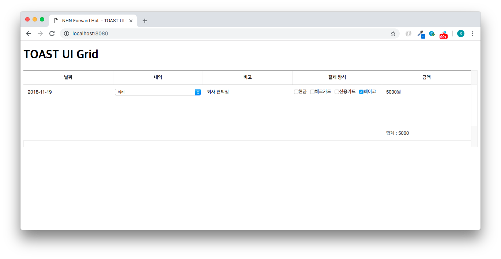

##############################
지출 비용 서식 변경하기
##############################

기본 레이아웃에 부가 정보들을 출력해줄 수 있도록 옵션을 추가해봅니다.
``formatter`` 와 ``summary`` 옵션 설정을 통해 데이터의 출력 형식을 변경하고 행의 연산 정보를 추가해봅니다.

formatter 옵션 설정하기
==============================

* ``formatter`` : 초기에 설정된 데이터 값에 단위를 추가하거나 출력 형식을 변경할 수 있는 함수형 옵션입니다.

.. code-block:: javascript

    ...

    const columnData = [
      ...
      {
        header: '금액',
        name: 'amount',
        editor: 'text',
        formatter({value}) { // 추가
          return `${value}원`;
        }
      }
    ];

summary 옵션 설정하기
==============================

* ``summary`` 옵션 설정을 통해 그리드 테이블에서 전체 행에 대한 연산(총합, 최댓값, 최솟값, 평균 등) 결과를 출력할 수 있습니다. 

  - ``summary.height``: 써머리 영역의 높이를 지정하며, 높이를 지정하지 않은 경우, 써머리 영역은 화면에 나타나지 않습니다.
  - ``summary.position``: 써머리 영역의 위치를 결정하는 옵션입니다. 기본값은 ``'bottom'`` 으로 테이블 하단에 정보가 출력되며, 해당 속성을 ``'top'`` 으로 설정한 경우, 써머리 영역은 헤더 아래에 위치합니다.
  - ``summary.columnContent``: 써머리 대상 컬럼의 내용을 설정합니다. 키는 컬럼의 이름, 값은 ``template`` 함수를 포함하는 객체입니다. ``template`` 함수는 HTML 문자열을 반환하며, 이 문자열은 각 컬럼(`<th>` 태그)을 렌더링할 때 사용됩니다.

.. code-block:: javascript

    ...

    const grid = new Grid({
      ...
      data: rowData,
      summary: { // 추가
        height: 40,
        position: 'bottom',
        columnContent: {
          amount: {
            template(valueMap) {
              return `합계 : ${valueMap.sum}원`;
            }
          }
        }
      }
    });

써머리 옵션에 대해 더 자세히 알고 싶다면 |summary| 을 참고해주세요.

.. |summary| raw:: html 

  <a href="https://github.com/nhn/tui.grid/blob/master/packages/toast-ui.grid/docs/ko/summary.md" target="_blank">튜토리얼</a>

결과 화면
==============================

